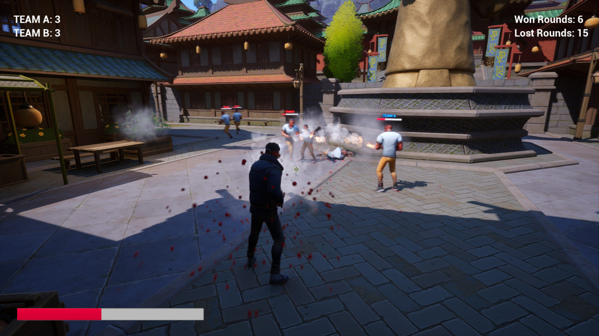
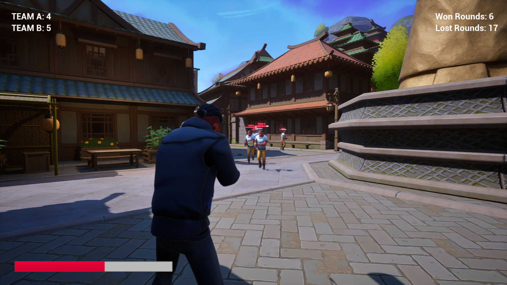
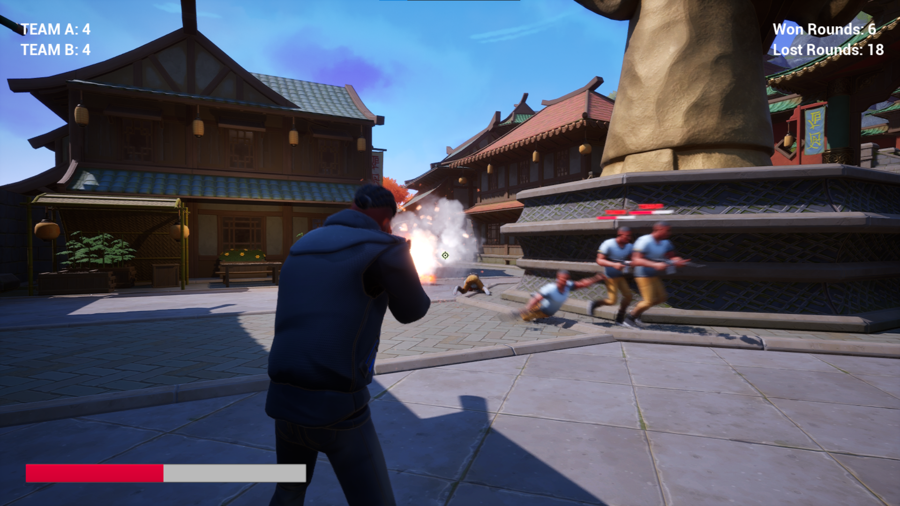
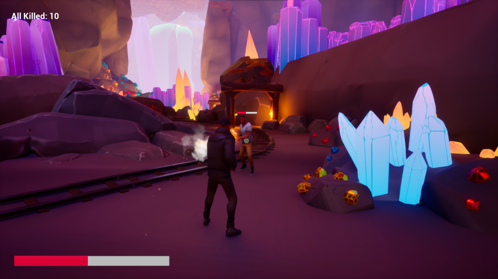
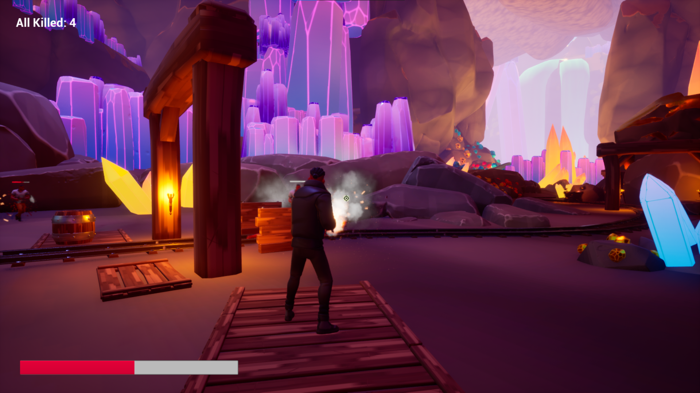
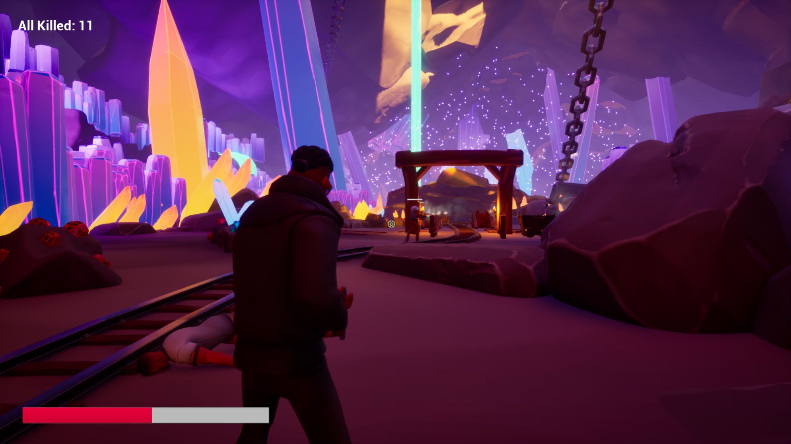

### TPP Shooting game

Game codded in Unreal Engine 5

## Authors

- [@Narothe](https://github.com/Narothe)
- [@enqer](https://github.com/enqer)
- [@fkielbasa](https://github.com/fkielbasa)

## About project

ShootFlow is a 3rd person perspective game. The game is being developed as a project for a course grade “Virtual Reality II”. The game was designed using Unreal Engine 5 graphics engine and was coded using Blueprint Visual Scripting. 

The development of the game was started without any knowledge of the Unreal Engine. After several months of work, many tutorials, reviewed online forums, documentation files, we managed to create the current stage of the game.

## Screenshots of the current version

Screenshot 1:

Screenshot 2:

Screenshot 3:

Screenshot 4:

Screenshot 5:

Screenshot 6:
